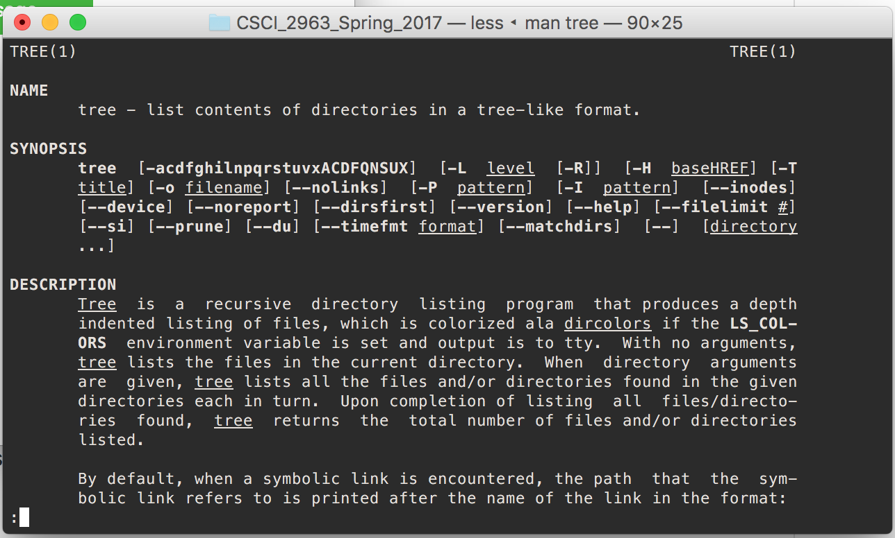
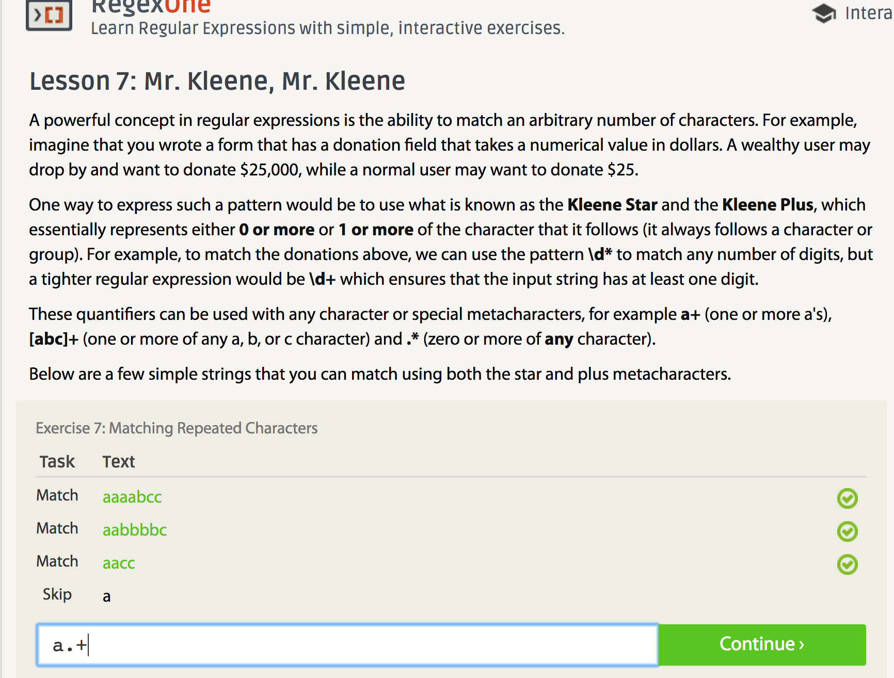
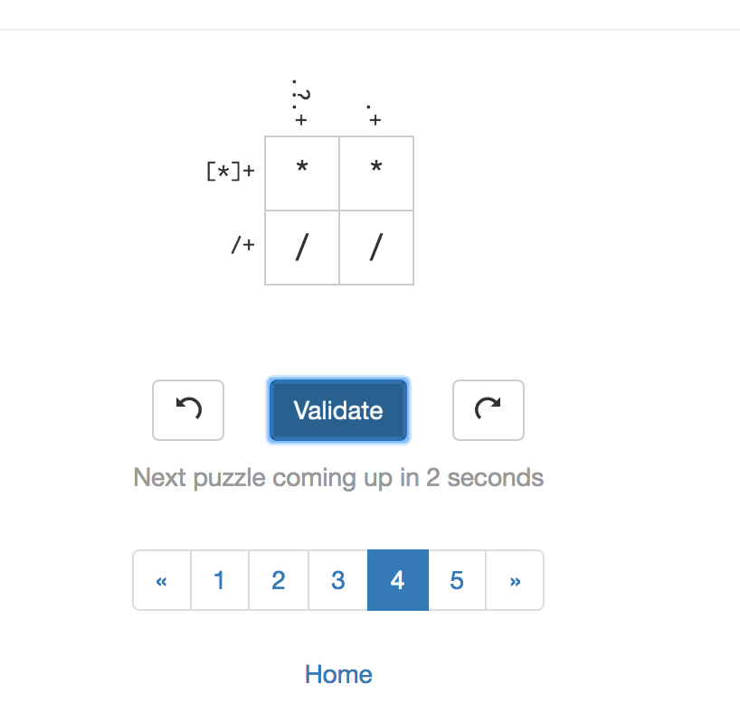
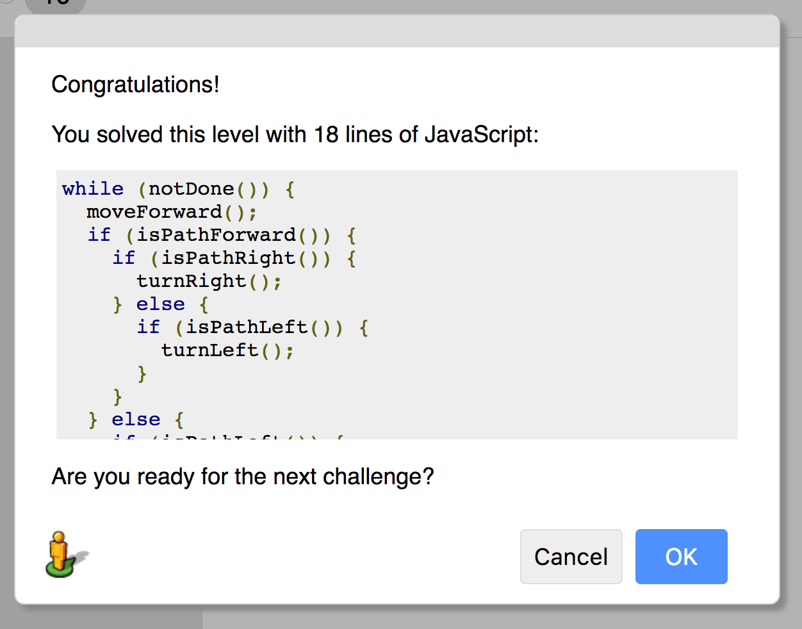

#Lab 1

##10 Criteria of Open Source
As a entry level programmer, I would say it is open source that leads me to the world of coding. I learned how to make robotics based on an open source hardware called Arduino, which is the thing I am most proud of. 

On one way, we could have access to the original code. On the other hand, we could modify it and make use out of it.


In real open source, you have the right to control your own destiny. 


##Smart Questions

1. Try to include the context of the problem, as much as possible, which can help others to understand the problem quickly.
2. Tey to provide the coding environment of the problem. For example, github could be a place where we can build the original code environment for others.

##Free Culture

When I was reading this chapter, I was so proud of being one of RPI, where I could meet more people with all kinds of talents. I am stil freshman now. However, it could be chllenged to work with other genius, not only because it is hard to work in a team, but also talent people are not likely to listen to others directly. I don't mean to say students cannot work together. However, it is just hard for people to trust each other when they are older. RPI is the connections get all of us together and work as a team. Why not change the world?

##Tree

##Regex

##RegexCrossword

##Blockly

##Reflection
Since the day I went to RPI as a web science student, I felt like SIS is a really old system and we really need to redesign it. Not only because its user-unfriendly design, but also its effiency. It is not related to a lot of other rpi websites, which makes life much harder. I would like to redesign or make use of some js modules to solve the problem.  